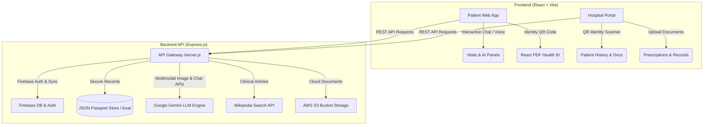

# 🏥 Arogya Sathi

[](https://www.typescriptlang.org/)
[](https://react.dev/)
[](https://expressjs.com/)
[](https://firebase.google.com/)
[](https://deepmind.google/technologies/gemini/)

**Arogya Sathi** is an intelligent, offline-capable, and multilingual digital health assistant and patient record ecosystem. Designed to bridge the gap between patient care and modern hospital workflows, it features an interactive AI companion (**Sathi**), secure digital health passports with dynamic QR codes, cloud report storage, and a robust hospital administration portal.

---

## 🌟 Key Capabilities

### 1. 🗣️ Multilingual AI Health Companion (Sathi)
* **Interactive AI Chatbot**: Converses naturally in **Telugu**, **Hindi**, and **English**.
* **Intelligent Symptom Checker**: Educates patients on conditions, self-care, and medical topics.
* **Smart Follow-ups**: Formulates context-aware questions to better gauge patient symptoms (e.g., duration, fever, pain).
* **Wiki Integration & Fallbacks**: Utilizes Google Gemini AI for advanced medical conversation, with fallbacks to localized health intelligence and Wikipedia API query routing.

### 2. 💳 Digital QR Health Passport & ID Card
* **Dynamic QR Codes**: Instant sharing of medical credentials.
* **OTP Access Control**: High-security, two-factor OTP verification allowing doctors/hospital staff to scan and view records only after patient permission.
* **Exportable PDF Health IDs**: Downloadable, print-ready, high-fidelity PDF medical cards via `@react-pdf/renderer`.

### 3. 📊 Medical Report & Image Analysis
* **Prescription & Image OCR**: Auto-scans and deciphers prescription images using Gemini Multimodal APIs.
* **Medical Report Summarization**: Ingests lengthy diagnostic reports and extracts key health parameters, risk scores, and actionable recommendations.
* **Vitals & Bio-Marker Insights**: Auto-generates structured health histories and vitals charts.

### 4. 🏥 Unified Hospital Administration Portal
* **Identity Scanner**: Scanner tool for clinic staff to retrieve verified patient files instantly.
* **Medical Records Registry**: Doctors and nurses can securely browse patient profiles, upload files, and update health charts.
* **Appointment & Session Management**: Live scheduling, virtual video session entries, and telemetry.

### 5. ☁️ Enterprise Cloud Storage with Local Fallbacks
* **AWS S3 Cloud Engine**: Secure uploads and pre-signed URLs with expirations for PDFs and raw reports.
* **Local Fallback Mode**: Works seamlessly in disconnected or network-isolated hospital servers by storing files in a JSON database schema.

---

## 📐 System Architecture

Below is the interaction flow between the Arogya Sathi client apps, backend server, and third-party integrations:



---

## 🛠️ Tech Stack
* **Frontend**: React 18, TypeScript, Tailwind CSS, Lucide icons, Framer Motion (micro-animations), React Router v6.
* **Backend**: Express, Multer (file handling), Archiver (zip generation), Node-Fetch.
* **Database / Backend-as-a-Service**: Firebase Firestore (users/appointments databases), Firebase Authentication (Google OAuth + Email/Password).
* **AI & LLM Services**: Gemini API (gemini-2.5-flash / gemini-2.0-flash fallbacks).
* **Cloud Infrastructure**: AWS SDK v3 (S3 Client, signed URLs), Firebase Hosting.

---

## ⚙️ Environment Variables Config

Create a `.env` file in the root directory based on the following template:

```env
# Frontend Client Ports
PORT=3001
VITE_API_BASE_URL=http://localhost:3001
PUBLIC_BASE_URL=http://localhost:5173

# Firebase Configurations (Frontend)
VITE_FIREBASE_API_KEY=your_firebase_api_key
VITE_FIREBASE_AUTH_DOMAIN=your_project.firebaseapp.com
VITE_FIREBASE_PROJECT_ID=your_project_id
VITE_FIREBASE_STORAGE_BUCKET=your_project.appspot.com
VITE_FIREBASE_MESSAGING_SENDER_ID=your_messaging_sender_id
VITE_FIREBASE_APP_ID=your_app_id
VITE_FIREBASE_MEASUREMENT_ID=your_measurement_id

# Google Gemini API
GEMINI_API_KEY=your_gemini_api_key
GEMINI_MODEL=gemini-2.5-flash
GEMINI_MODEL_FALLBACKS=gemini-2.0-flash-001,gemini-2.0-flash

# AWS S3 Cloud Storage (Optional - falls back to local storage if omitted)
AWS_ACCESS_KEY_ID=your_aws_access_key
AWS_SECRET_ACCESS_KEY=your_aws_secret_key
AWS_REGION=ap-south-1
AWS_S3_BUCKET=your_s3_bucket_name
```

---

## 🚀 Getting Started

### Prerequisites
* **Node.js** v18 or newer
* **npm** (comes with Node.js)

### Installation
1. Clone the repository:
   ```bash
   git clone https://github.com/JagadeeshChandra12/ArogyaSathi.git
   cd ArogyaSathi
   ```
2. Install dependencies:
   ```bash
   npm install
   ```
3. Initialize the health passport database:
   ```bash
   # Create a local store from the example template
   cp data/health-passport-store.example.json data/health-passport-store.json
   ```

### Running Locally
* **Run full stack (Frontend & API Server concurrently)**:
   ```bash
   npm run dev:full
   ```
  * Web Client: `http://localhost:5173`
  * API Server: `http://localhost:3001`

* **Run Frontend Client Only**:
   ```bash
   npm run dev
   ```

* **Run API Server Only**:
   ```bash
   npm run server
   ```

---

## 📦 Deployment Guide

### Frontend Deployment
#### Option A: Firebase Hosting (Pre-configured)
1. Install Firebase CLI globally if you haven't:
   ```bash
   npm install -g firebase-tools
   ```
2. Log in and initialize:
   ```bash
   firebase login
   ```
3. Build and deploy:
   ```bash
   npm run build
   ```
   ```bash
   firebase deploy
   ```

#### Option B: Vercel
1. Run Vercel deploy using `npx`:
   ```bash
   npx vercel
   ```
2. Set `VITE_API_BASE_URL` to your deployed API server endpoint in Vercel's project dashboard.

### Backend API Server Deployment (Node.js)
The backend server (`server.js`) can be deployed to platforms like **Render**, **Railway**, or **Heroku**:
* **Build Command**: `npm install; npm run build`
* **Start Command**: `node server.js`
* **Port**: Configure `PORT` environment variable (default: `3001`)
* Ensure you add all database, AWS S3, and Gemini keys to the platform's Environment Variables panel.

---

## 🔒 Security & Privacy
* Patient profiles are private and tied to Firebase Authentication.
* Medical information sharing via QR code is gated by a one-time OTP generated on the user's phone, which must be provided to the clinic staff to authorize record decryption.
* Cloud URLs generated for medical files expire in 5 minutes via AWS S3 Signed URLs.

## 📄 License
This project is licensed under the MIT License - see the [package.json](package.json) file for details.
